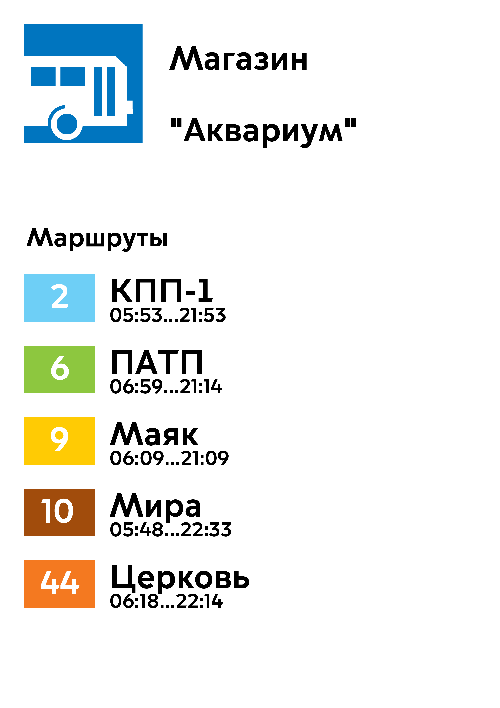
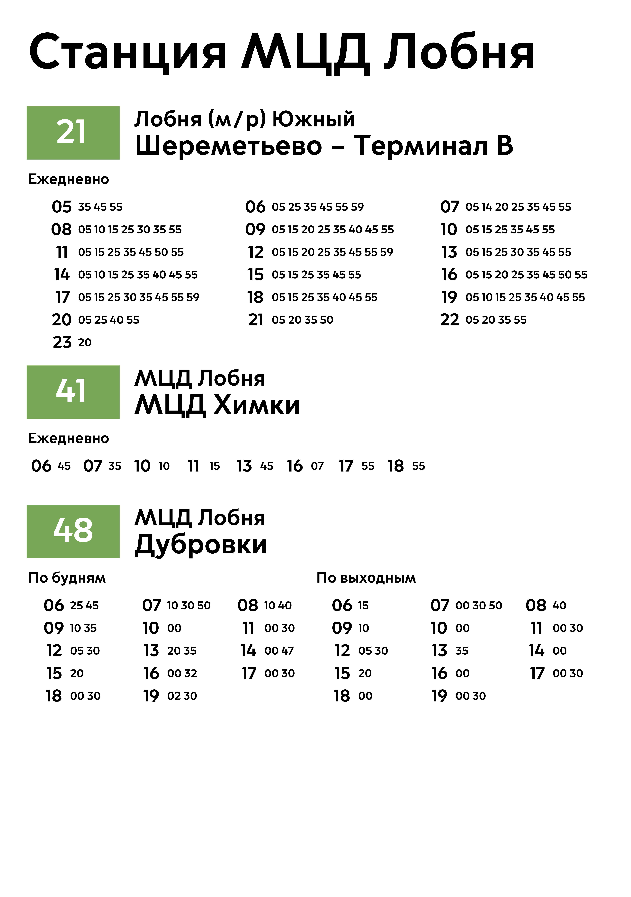
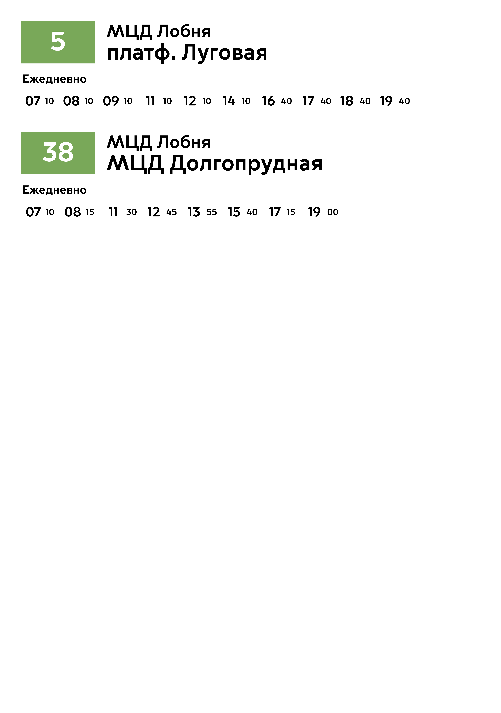

# Визуализация фида GTFS
Репозиторий предназначен для того, чтобы показать различные методы обработки данных GTFS в целях визуализации информации.  
Обработка фида происходит с помощью библиотеки `pandas`, визуализация - с помощью `pyfpdf`
## Простой флаг на остановку

---

## Лист **475x675** с автокомпоновкой

---

---