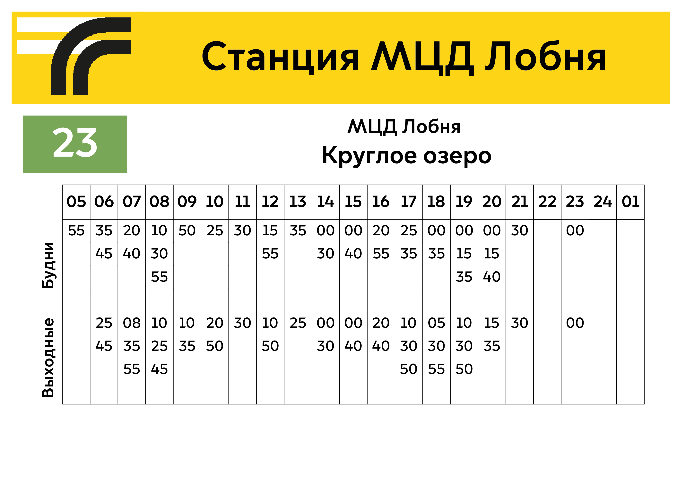
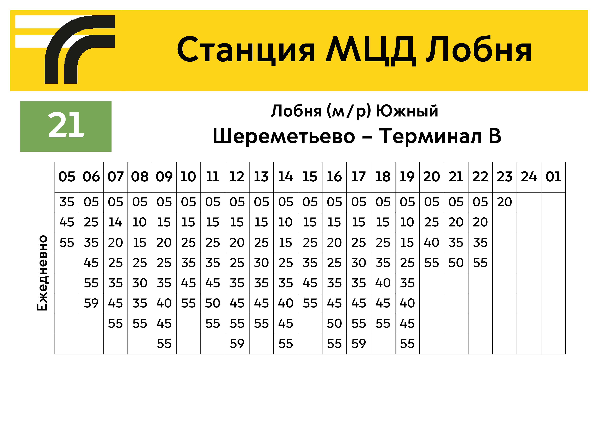

# Визуализация фида GTFS
Репозиторий предназначен для того, чтобы показать различные методы обработки данных GTFS в целях визуализации информации.  
Обработка фида происходит с помощью библиотеки `pandas`, визуализация - с помощью `pyfpdf`

## Feed

В `feed.py` содержится класс `Feed` с набором функций:

- Инициализация: необходимо указать полный путь папки, содержащей GTFS:
```python
folder = '/home/gamma/.../uud/gtfs'
feed = Feed(folder)
```
- DescribeForFlag: информация по маршрутам остановки `stop_id`, отдаёт время работы по каждому из маршрутов
```python
stop = feed.DescribeForFlag(stop_id)
```
- DescribeForLayout: информация по маршрутам остановки `stop_id`, отдаёт расписание по ключам `service_keys`
```python
stop = feed.DescribeForLayout(stop_id, ['wd', 'we', 'ed'])
```
- GetGeomOfStop: выборка из GTFS по маршрутам остановки `stop_id`, отдаёт несколько `GeoDataFrame` с выборками
```python
stops_selection, stop_times_selection, trips_selection, shape_selection, routes_selection = feed.GetGeomOfStop(stop_id)
```
- SaveSelectionOfStop: сохраняет выборку из GTFS по маршрутам остановки `stop_id` в папке `folder`
```python
stop_folder = feed.SaveSelectionOfStop(stop_id, folder)
```

## Loom

В `feed.py` также содержится класс `Loom` с набором функций:

- Инициализация: аналогично инициализации `Feed`, необходимо указать путь папки, содержащей GTFS
```python
loom=Loom('/home/gamma/.../uud/gtfs', stop_id=23)
```
- Функции C++ пакета `loom`, запускаемые с помощью `subprocess.run`:
```python
loom.gtfs2graph()

loom.topo(max_aggr_dist=250, smooth=0.1)

loom.loom(optim_method='ilp', ilp=True, ilp_num_threads=10, ilp_solver='cbc')

loom.transitmap(render_engine='svg', line_width=40, line_spacing=10, render_dir_markers=True,tight_stations=True, no_render_node_connections=True)

loom.transitmap(render_engine='mvt', z=[14,15,16,17], line_width=40, line_spacing=10, render_dir_markers=True, tight_stations=True, no_render_node_connections=True)
```
Важно: не все параметры функций пакета определены в `feed.py`. Запуск возможен, только если в системе установлен `loom`

Векторные тайлы можно декодировать:
```python
lines, stations, inner_connections = loom.decode_mvt(zl=14)
```
В результате отдаёт GeoJSON с слоями остановок, сдвинутых маршрутов и соединённых пересечений
# Примеры визуализаций
## Простой флаг на остановку


---

## Лист **475x675** с автокомпоновкой


---

## Лист А4 горизонтальный с постоянной компоновкой




