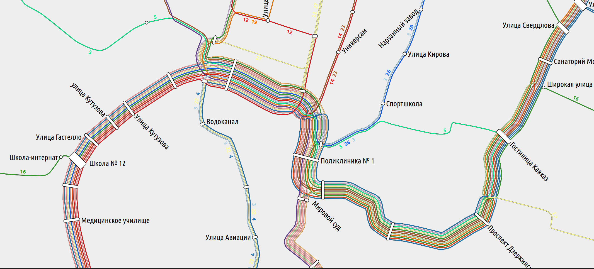
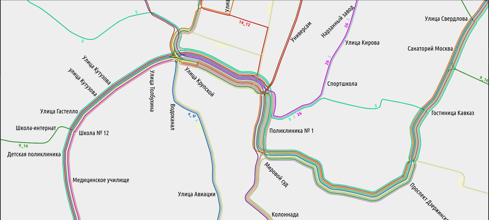

# Попытка объединения маршрутов автобуса для составления карты

В большинстве случаев каждый маршрут имеет свой уникальный цвет, с которым он наносится на карту. В отдельных случаях цвет - способ группировки маршрутов по функции. В Москве группы социальных и межрайонных маршрутов имеют единый цвет - розовый и голубой соответственно, а магистральные с ночными - уникальные (но повторяющиеся) цвета.

Поскольку `loom` при большом количестве маршрутов не может решить задачу определения порядка отрисовки линий без *gurobi*,нужно прибегнуть к генерализации маршрутов путем их объединения по признаку. В случае Москвы и Московской области всё понятно, а в остальных - условимся, что объединять будем маршруты, имеющие наибольший процент взаимного дублирования. Может потеряться читаемость карты, это стоит проверить.

### Идея генерализации

В *GTFS* каждый маршрут в `routes.txt` имеет атрибут `route_color`. Получим JSON-граф из *GTFS*:

> gtfs2graph [folder] | topo --smooth=1 --random-colors --max-aggr-dist=110 > graph.json

В этом `graph.json`, очевидно, хранятся:

- nodes:

```json
{
      "type": "Feature",
      "geometry": {
        "type": "Point",
        "coordinates": [42.7087795527, 43.9174214993]
      },
      "properties": {
        "deg": "4",
        "deg_in": "4",
        "deg_out": "4",
        "excluded_conn": [
          {
            "line": "0x5ea7d78e6320",
            "node_from": "0x615a9642b7f0",
            "node_to": "0x615a97daad30"
          }, 
          ...
          }],
        "id": "0x615a9590e1f0",
        "not_serving": ["0x5ea7d78e5d80", "0x5ea7d78e59f0", "0x5ea7d78e6320"],
        "station_id": "128",
        "station_label": "Ленинградская улица"
      }
    }, 
```

- edges: 
```json
{
      "type": "Feature",
      "geometry": {
        "type": "LineString",
        "coordinates": ...
      "properties": {
        "dbg_lines": "13,27,28,10,18,26,11,29,14,12",
        "from": "0x615a97d91e20",
        "id": "0x615a95f44720",
        "lines": [
          {
            "color": "1f78b4",
            "id": "0x5ea7d78e68a0",
            "label": "13"
          }, 
          ...
    }, 
```

То есть в списке маршрутов, проходящих через ребро, нужно поменять `label`, `color`, `id` на совмещенный. 

В `generalize_routes.py` словарь совмещения линий пока сделан вручную, **TODO**: сделать совмещение по уникальным цветам из графа.

```python
generalizer={
    '10': {'label': '10_11_29_18', 'id': hex(int(hex10, 16)+int(hex11, 16)+int(hex29, 16)+int(hex18, 16))},
    '11': {'label': '10_11_29_18', 'id': hex(int(hex10, 16)+int(hex11, 16)+int(hex29, 16)+int(hex18, 16))}, 
    '29': {'label': '10_11_29_18', 'id': hex(int(hex10, 16)+int(hex11, 16)+int(hex29, 16)+int(hex18, 16))}, 
    '18': {'label': '10_11_29_18', 'id': hex(int(hex10, 16)+int(hex11, 16)+int(hex29, 16)+int(hex18, 16))},
    '4': {'label': '4_13', 'id': hex(int(hex4, 16)+int(hex13, 16))},
    '13': {'label': '4_13', 'id': hex(int(hex4, 16)+int(hex13, 16))},
    '9': {'label': '9_16', 'id': hex(int(hex9, 16)+int(hex16, 16))},
    '16': {'label': '9_16', 'id': hex(int(hex9, 16)+int(hex16, 16))},
    '14': {'label': '14_12', 'id': hex(int(hex14, 16)+int(hex12, 16))},
    '12': {'label': '14_12', 'id': hex(int(hex14, 16)+int(hex12, 16))},
    '25': {'label': '25_23', 'id': hex(int(hex25, 16)+int(hex23, 16))},
    '23': {'label': '25_23', 'id': hex(int(hex25, 16)+int(hex23, 16))},
    '22': {'label': '22_27', 'id': hex(int(hex22, 16)+int(hex27, 16))},
    '27': {'label': '22_27', 'id': hex(int(hex22, 16)+int(hex27, 16))},
    }
```

По предварительным тестам, это работает. На участке от Гастелло до Кутузова 11 маршрутов в оригинале



А на генерализованной - как я и хотел - 7 маршрутов (совмещены `9+16`, `10+11+29+18`)



#### В тайлах: [Транспорт Кисловодска](https://gammapopolam.github.io/gtfs-feed-vis/loom_generalize/) (*только 16-17 зумы*)
